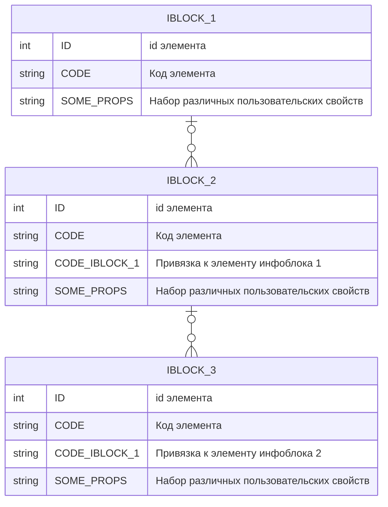

# Описание конпонента
Компонент `iblcok.tree` - предназначен для вывода списка взаимосвязанных элементов различных инфоблоков и их пользовательских свойств.
## Требования
- Глубина вложенности инфоблоков равна `3`
- Наличие родителя опционально
- Набор пользовательских свойств и их кодовое обозначение может быть разным
- Настроенный кеш
## Схема инфоблоков
