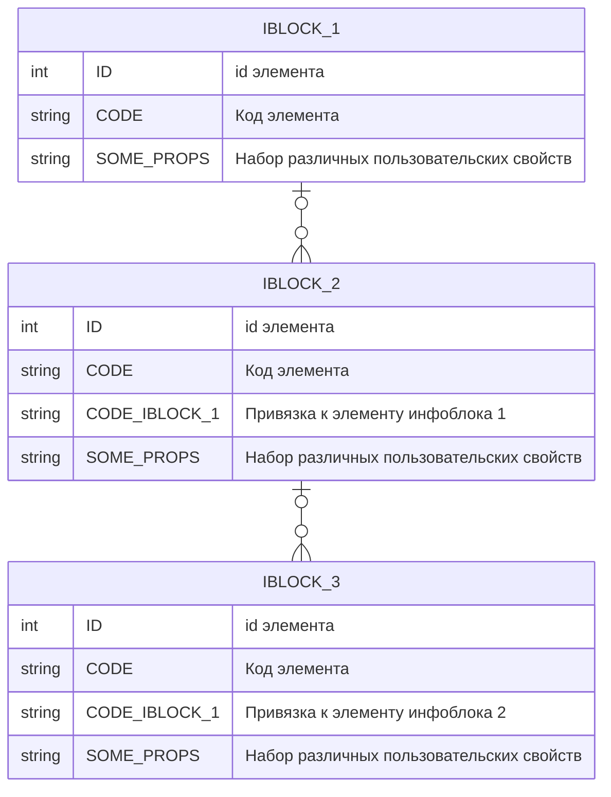

# Описание конпонента
Компонент `iblcok.tree` - предназначен для вывода списка взаимосвязанных элементов различных инфоблоков и их пользовательских свойств. 
## Особенности
- Глубина вложенности инфоблоков равна `3`
- Наличие родителя опционально
- Набор пользовательских свойств и их кодовое обозначение может быть разным
- Настроенный кеш
- Используется классический подход
## Схема инфоблоков

## Параметры
- `IBLOCK_TYPE` - тип инфоблоков
- `ROOT_IBLOCK_ID` - `id` корневого инфоблока (родитель для `MIDDLE_IBLOCK_ID`)
- `MIDDLE_IBLOCK_ID` - `id` промежуточного инфоблока (родитель для `TOP_IBLOCK_ID`, потомок `ROOT_IBLOCK_ID`)
- `TOP_IBLOCK_ID` - `id` последнего в цепочке инфоблока (потомок `MIDDLE_IBLOCK_ID`)
- `TOP_PROPERTY_CODE` - коды пользовательских свойств корневого инфоблока 
- `MIDDLE_PROPERTY_CODE` - коды пользовательских свойств промежуточного инфоблока 
- `TOP_PROPERTY_CODE` - коды пользовательских свойств верхнего (последнего) инфоблока
- `MIDDLE_TO_ROOT_PROPERTY_CODE` - код свойства привязки к элементу корневого инфоблока у промежуточного инфоблока
- `TOP_TO_MIDDLE_PROPERTY_CODE` - код свойтсва привязка к элементу промежуточного инфоблока у вернехно инфоблока 
- `CACHE_TIME` - время жизни кеша в секундах

## Использовал следующие источники для создания
1. [Простой пример создания компонента](https://dev.1c-bitrix.ru/learning/course/index.php?COURSE_ID=43&LESSON_ID=2305)
2. [Типизация в php](https://metanit.com/php/tutorial/4.5.php)
3. [Методы класса CIBlockParameters модуля iblock](https://aclips.ru/bitrix24-api-list/iblock__ciblockparameters/)

### Ориентировался на код

**Расмещение на странице стандартного компонента списка новостей**
```php
<? $APPLICATION->IncludeComponent(
	"bitrix:news.list",
	"projects-list_test",
	[
		"ACTIVE_DATE_FORMAT" => "d.m.Y",
		"ADD_SECTIONS_CHAIN" => "Y",
		"AJAX_MODE" => "N",
		"AJAX_OPTION_ADDITIONAL" => "",
		"AJAX_OPTION_HISTORY" => "N",
		"AJAX_OPTION_JUMP" => "N",
		"AJAX_OPTION_STYLE" => "Y",
		"CACHE_FILTER" => "N",
		"CACHE_GROUPS" => "Y",
		"CACHE_TIME" => "36000000", // время жизни кеша
		"CACHE_TYPE" => "A",
		"CHECK_DATES" => "Y",
		"COMPONENT_TEMPLATE" => "projects-list_test",
		"DETAIL_URL" => "",
		"DISPLAY_BOTTOM_PAGER" => "Y",
		"DISPLAY_DATE" => "Y",
		"DISPLAY_NAME" => "Y",
		"DISPLAY_PICTURE" => "Y",
		"DISPLAY_PREVIEW_TEXT" => "Y",
		"DISPLAY_TOP_PAGER" => "N",
		"FIELD_CODE" => [ // Выбранные поля элемента
			0 => "ID",
			1 => "CODE",
			2 => "",
		],
		"FILTER_NAME" => "arFilter",
		"HIDE_LINK_WHEN_NO_DETAIL" => "N",
		"IBLOCK_ID" => "19",
		"IBLOCK_TYPE" => "dashboards",
		"INCLUDE_IBLOCK_INTO_CHAIN" => "Y",
		"INCLUDE_SUBSECTIONS" => "Y",
		"MEDIA_PROPERTY" => "",
		"MESSAGE_404" => "",
		"NEWS_COUNT" => "20",
		"PAGER_BASE_LINK_ENABLE" => "N",
		"PAGER_DESC_NUMBERING" => "N",
		"PAGER_DESC_NUMBERING_CACHE_TIME" => "36000",
		"PAGER_SHOW_ALL" => "N",
		"PAGER_SHOW_ALWAYS" => "N",
		"PAGER_TEMPLATE" => ".default",
		"PAGER_TITLE" => "Новости",
		"PARENT_SECTION" => "",
		"PARENT_SECTION_CODE" => "",
		"PREVIEW_TRUNCATE_LEN" => "",
		"PROPERTY_CODE" => [ // Выбранные пользовательские свойства
			0 => "PR_COMPLETE_CTR_COUNT",
			1 => "PR_ALL_CTR_COUNT",
			2 => "PR_PLANNED_CTR_COUNT",
			3 => "PR_RISK_CTR_COUNT",
			4 => "PR_COMPLETE_RESULT_COUNT",
			5 => "PR_ALL_RESULT_COUNT",
			6 => "PR_RISK_RESULT_COUNT",
			7 => "PR_PLAN_SUMM",
			8 => "PR_TYPE",
			9 => "PR_FACT_SUMM",
			10 => "",
		],
		"SEARCH_PAGE" => "/search/",
		"SET_BROWSER_TITLE" => "Y",
		"SET_LAST_MODIFIED" => "N",
		"SET_META_DESCRIPTION" => "Y",
		"SET_META_KEYWORDS" => "Y",
		"SET_STATUS_404" => "N",
		"SET_TITLE" => "N",
		"SHOW_404" => "N",
		"SLIDER_PROPERTY" => "",
		"SORT_BY1" => "PROPERTY_RES_DATE_PLAN_START",
		"SORT_BY2" => "SORT",
		"SORT_ORDER1" => "ASC",
		"SORT_ORDER2" => "ASC",
		"STRICT_SECTION_CHECK" => "N",
		"TEMPLATE_THEME" => "blue",
		"USE_RATING" => "N",
		"USE_SHARE" => "N"
	],
	false
); ?>
```
**Шаблон для настройки параметра в .parameters.php**

```php
"код параметра" => array(
	"PARENT" => "код группы",  // если нет - ставится ADDITIONAL_SETTINGS
	"NAME" => "название параметра на текущем языке",
	"TYPE" => "тип элемента управления, в котором будет устанавливаться параметр",
	"REFRESH" => "перегружать настройки или нет после выбора (N/Y)",
	"MULTIPLE" => "одиночное/множественное значение (N/Y)",
	"VALUES" => "массив значений для списка (TYPE = LIST)",
	"ADDITIONAL_VALUES" => "показывать поле для значений, вводимых вручную (Y/N)",
	"SIZE" => "число строк для списка (если нужен не выпадающий список)",
	"DEFAULT" => "значение по умолчанию",
	"COLS" => "ширина поля в символах",
)
```